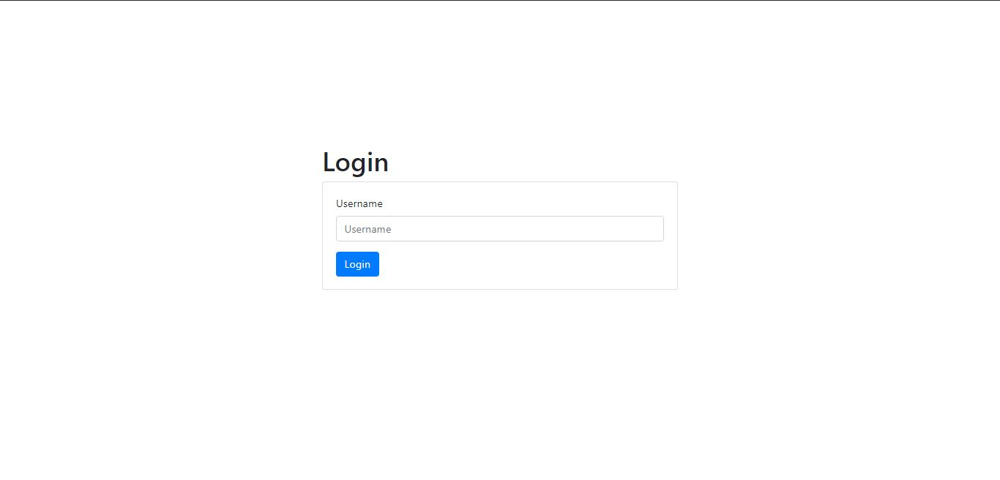
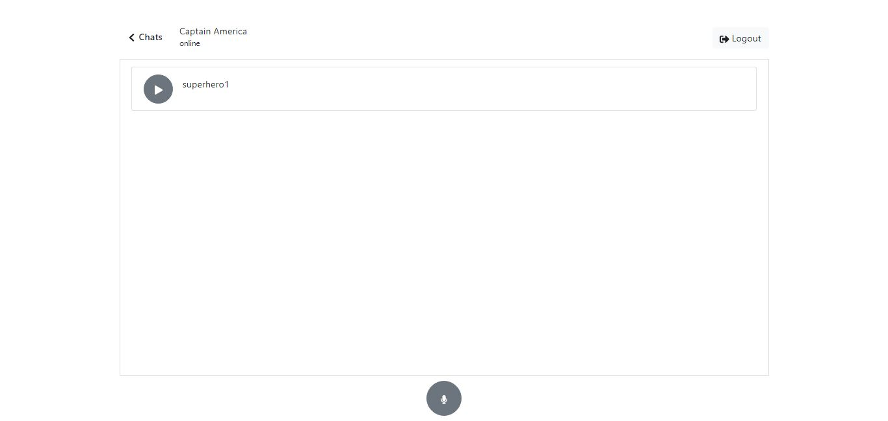

# Ephemeral Voice Messaging React

In this app, we're going to build an ephemeral voice messaging chat app that automatically erases itself after the receiver has listened to it.

### Screenshots




### Technologies

This demo app uses the following:

- [CometChat Pro](https://cometchat.com)
- [React.js](https://reactjs.org)
- [Bootstrap](https://getbootstrap.com)

### Running the demo application

In order to run the demo application locally, you'll need to follow the following steps:

1. Create an account with [CometChat Pro](https://cometchat.com)
2. Head over to the [CometChat Pro Dashboard](https://app.cometchat.com/#/apps), create a new app called **Ephemeral Voice Messaging React** hit the **+** button.
3. You should be redirected to your newly created app, now click on the **Explore** button to view your app details.
4. Go to the **API Keys** tab and you should see an already generated **App ID** and **API Key**
5. Copy the details from the list with **Full Access** as Scope.
6. Clone the repository by running `git clone https://github.com/cometchat-pro-tutorials/ephemeral-voice-messaging-react.git` in the terminal and open it with the code editor of your choice.
7. `cd` into the newly created folder and run `npm install` to install dependencies.
8. At the root of your project foleder, create a `.env` file and paste the following snippet.

```
REACT_APP_COMETCHAT_API_KEY=YOUR_API_KEY
REACT_APP_COMETCHAT_APP_ID=YOUR_APP_ID
```

9. Run `npm start` and wait for the development server to start.
10. Open the page `http://localhost:3000` on two different browsers to see the app.
11. Use any of the default usernames **SUPERHERO1**, **SUPERHERO2**, **SUPERHERO3**, **SUPERHERO4**, **SUPERHERO5** to login and start sending voice messages.

### Useful Links

- [CometChat Pro JavaScript SDK Documentation](https://prodocs.cometchat.com/docs/js-quick-start)
- [CometChat Pro Dashboard](https://app.cometchat.com/#/apps)
- [Bootstrap](https://getbootstrap.com)
